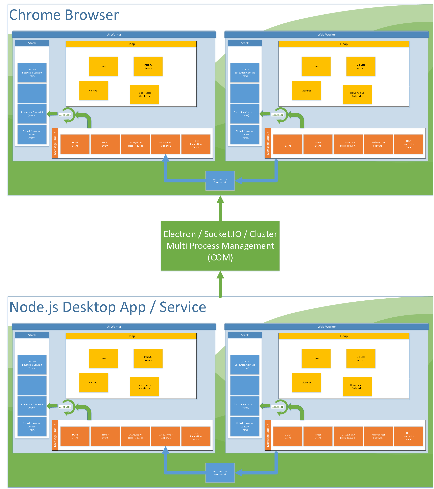

# Javascript-3 Async Programming Chains and Promises

## Agenda
* Javascript Event Loop
* Timers and DOM Callbacks
* Promises (Tasks)
* AJAX Callbacks
* Bonus - AMD Modules & Require.JS page loading
* Bonus - V8 Engine (Node.js / Chrome)
* Optional - Missed Point on Variable Classes

## Code Location

~~~~
V:\IPG\Users\SDavis\Trainings\Javascript Training\Javascript-3 Async Programming Chains and Promises
~~~~

## Javascript Event Loop

## Timers and DOM Callbacks

<a href="Timers and DOM Events.html" target="_blank">Examples on a page</a>

## Promises (Tasks)

First there were deferred in jQuery, then Q promived on it, then got adopted into the ECMAScript 2015 (es6).
<a href="http://kangax.github.io/compat-table/es6/" target="_blank">es6 Adoption</a>

<a href="Promises.html" target="_blank">Examples on a page</a>

## AJAX Callbacks

<a href="https://en.wikipedia.org/wiki/Ajax_(programming)" target="_blank">Asynchronous Javascript And XML (AJAX) was an iteration of WebDev after Service Side Rending to allow parts of a page to be refreshed.</a>

<a href="https://en.wikipedia.org/wiki/XMLHttpRequest" target="_blank">XMLHttpRequest is a browser API that allows Javascript to request data from a Web Service.</a>

<a href="AJAX Callbacks.html" target="_blank">Examples on a page</a>

## AMD Modules & Require.JS page loading

<a href="https://en.wikipedia.org/wiki/Asynchronous_module_definition" target="_blank">Asynchronous Module Definition (AMD)</a> is a depenency injection system for WebDev

<a href="https://github.com/volojs/create-template/tree/master/www" target="_blank">Example walkthru</a>

## Bonus - V8 Engine (Node.js / Chrome)

### On-Stack Replacement
The V8 Engine quickly parses and compiles non-optimized code with profiling when it gets passed some Javascript text.
It periodicically analyzes the holistic profile to determine where optimization is needed.  So a deeply nested function goes first, then its caller, and so forth.

Deoptimization - The optimization process specilizes to the types that the profiler recorded.  If a particular invocation provides novel returns, the running callstack is paused, the function is returned to its unoptimized version (perhaps restoring some inlined functions), and execution continues.

## Missed Point on Variable Classes

[Resource: www.w3schools.com](http://www.w3schools.com/js/js_mistakes.asp)

<a href="Javascript Native Objects.html" target="_blank">Javascript Native Objects</a>

